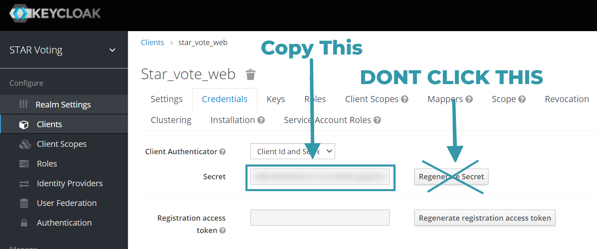

# Set up star.vote locally

<!-- Most of this setup was shamelessly copied from https://raw.githubusercontent.com/freeCodeCamp/freeCodeCamp/main/docs/how-to-setup-freecodecamp-locally.md-->

Follow these guidelines for setting up star.vote locally on your system. This is highly recommended if you want to contribute regularly.

Some of these contribution workflows – like fixing bugs in the codebase – need you to run star.vote locally on your computer.

> **What's the difference between star.vote and dev.star.vote ?**<br>
> The current star.vote is an old implementation with a separate codebase. dev.star.vote is a work in progress, and will eventually become the new star.vote. When I mention star.vote in the guide I'm referring to the new star.vote

## Prepare your local machine

Start by installing the prerequisite software for your operating system.

### Prerequisites:

| Prerequisite                                                                                  | Version    | Notes                                                                                       |
| --------------------------------------------------------------------------------------------- | ---------- | ------------------------------------------------------------------------------------------- |
| [Node.js](http://nodejs.org)                                                                  | `16.x`     | -                                                                                           |
| npm (comes bundled with Node)                                                                 | `8.x`      | -                                                                                           |
| *insert DB software here*                                                                     |            | -                                                                                           |

> If you have a different version, please install the recommended version. We can only support installation issues for recommended versions. See [troubleshooting](#troubleshooting) for details.

If Node.js is already installed on your machine, run the following commands to validate the versions:

```
node -v
npm -v
```

> We highly recommend updating to the latest stable releases of the software listed above, also known as Long Term Support (LTS) releases.

Once you have the prerequisites installed, you need to prepare your development environment. This is common for many development workflows, and you will only need to do this once.

### Follow these steps to get your development environment ready:

1. Install [Git](https://git-scm.com/) or your favorite Git client, if you haven't already. Update to the latest version; the version that came bundled with your OS may be outdated.

1. Install a code editor of your choice.

   We highly recommend using [Visual Studio Code](https://code.visualstudio.com/).

4. Set up linting for your code editor. (NOTE: we don't actually have this yet, but we should at some point so I'm leaving the instructions here)

   You should have [ESLint running in your editor](http://eslint.org/docs/user-guide/integrations.html), and it will highlight anything that doesn't conform to [freeCodeCamp's JavaScript Style Guide](http://forum.freecodecamp.org/t/free-code-camp-javascript-style-guide/19121).

   > Please do not ignore any linting errors. They are meant to **help** you and to ensure a clean and simple codebase.

## Fork the repository on GitHub

[Forking](https://help.github.com/articles/about-forks/) is a step where you get your own copy of star.vote's main repository (a.k.a _repo_) on GitHub.

This is essential, as it allows you to work on your own copy of star.vote on GitHub, or to download (clone) your repository to work on locally. Later, you will be able to request changes to be pulled into the main repository from your fork via a pull request (PR).

> The main repository at `https://github.com/Equal-Vote/star-server` is often referred to as the `upstream` repository.
>
> Your fork at `https://github.com/YOUR_USER_NAME/star-server` is often referred to as the `origin` repository. `YOUR_USER_NAME` would be replaced with your GitHub username.

**Follow these steps to fork the `https://github.com/Equal-Vote/star-server` repository:**

1. Go to the star.vote repository on GitHub: <https://github.com/Equal-Vote/star-server>

2. Click the "Fork" Button in the upper right-hand corner of the interface ([More Details Here](https://help.github.com/articles/fork-a-repo/))

3. After the repository has been forked, you will be taken to your copy of the star.vote repository at `https://github.com/YOUR_USER_NAME/star-server` (`YOUR_USER_NAME` would be replaced with your GitHub user name.)

<details>
   <summary>
      How to fork on GitHub (screenshot)
   </summary>
   <br>
   
</details>

## Clone your fork from GitHub

[Cloning](https://help.github.com/articles/cloning-a-repository/) is where you **download** a copy of a repository from a `remote` location that is either owned by you or by someone else. In your case, this remote location is your `fork` of freeCodeCamp's repository that should be available at `https://github.com/YOUR_USER_NAME/star-server`. (`YOUR_USER_NAME` would be replaced with your GitHub user name.)

Run these commands on your local machine:

1. Open a Terminal / Command Prompt / Shell in your projects directory

   _i.e.: `/yourprojectsdirectory/`_

2. Clone your fork of star.vote, replacing `YOUR_USER_NAME` with your GitHub Username

   ```
   git clone --depth=1 https://github.com/YOUR_USER_NAME/star-server.git
   ```

This will download the entire freeCodeCamp repository to your projects directory.

Note: `--depth=1` creates a shallow clone of your fork, with only the most recent history/commit.

## Set up syncing from parent

Now that you have downloaded a copy of your fork, you will need to set up an `upstream` remote to the parent repository.

[As mentioned earlier](#fork-the-repository-on-github), the main repository is referred `upstream` repository. Your fork referred to as the `origin` repository.

You need a reference from your local clone to the `upstream` repository in addition to the `origin` repository. This is so that you can sync changes from the main repository without the requirement of forking and cloning repeatedly.

1. Change directory to the new star-server directory:

   ```
   cd star-server
   ```

2. Add a remote reference to the main star.vote repository:

   ```
   git remote add upstream https://github.com/Equal-Vote/star-server.git
   ```

3. Ensure the configuration looks correct:

   ```
   git remote -v
   ```

   The output should look something like below (replacing `YOUR_USER_NAME` with your GitHub username):

   ```
   origin      https://github.com/YOUR_USER_NAME/star-server (fetch)
   origin      https://github.com/YOUR_USER_NAME/star-server (push)
   upstream        https://github.com/Equal-Vote/star-server (fetch)
   upstream        https://github.com/Equal-Vote/star-server (push)
   ```

## Running star.vote locally

Now that you have a local copy of star.vote, you can follow these instructions to run it locally.

To run the server locally run the following commands
```
# terminal 1
cd backend
npm install
npm start
```

To run the web client run the following commands. If you want to just run the web client without setting up the server you can change the proxy under frontend/package.json to "proxy": "dev.star.vote". 
```
# terminal 2
cd frontend
npm install
npm start
```

This will allow you to:

- Preview edits to pages as they would appear on star.vote.
- Work on UI related issues and enhancements.
- Debug and fix issues with the application servers and client apps.

If you do run into issues, first perform a web search for your issue and see if it has already been answered. If you cannot find a solution, please search our [GitHub issues](https://github.com/Equal-Vote/star-server/issues) page for a solution and report the issue if it has not yet been reported.

And as always, feel free to ask questions on the [#_software-dev slack channel](https://starvoting.slack.com/archives/C01EBAT283H).

> If you haven't joined the STAR Voting slack yet, you can follow the instructions [here](https://www.starvoting.us/get_involved) to get added

> You may skip running star.vote locally if you are simply editing files. For instance, performing a `rebase`, or resolving `merge` conflicts.
>
> You can always return to this part of the instructions later. You should **only** skip this step if you do not need to run the apps on your machine.
>
> [Skip to making changes](#making-changes-locally).

### Configuring dependencies

#### Step 1: Set up the environment variable file

The default environment variables are stored in the file `sample.env`. This file needs to be copied to a new file named `.env` that is accessed dynamically during the installation step.

```
# Create a copy of the "sample.env" and name it ".env".
```

<!-- Note: This tabs feature looks cool, we should look into it -->

<!-- tabs:start -->

#### **macOS/Linux**

```
cp sample.env .env
```

#### **Windows**

```
copy sample.env .env
```

<!-- tabs:end -->

All the secret keys are left blank in `sample.env` but you can request access to [this](https://docs.google.com/document/d/1D4CJ9l6lnR39YYPUvw_HbeUVXNR-tAbNF6eT89oxEuk) google doc to see those

The keys in the `.env` file are _not_ required to be changed to run the app locally. You can leave the default values copied over from `sample.env` as-is.

<details markdown="1">
<summary>
If you want to login, follow these steps to retrieve the ``KEYCLOAK_SECRET`` value
</summary>
1. In the [#_software-dev slack channel](https://starvoting.slack.com/archives/C01EBAT283H), ask for keycloak admin access, and we can set you up with an account (assuming we trust you of course ;) )
1. Navigate to https://keycloak.6j0.org/ and click Administration Console
1. Login w/ your admin credentials (this is using the master realm, so it's different from your star.vote credentials)
1. Navigate to Clients > star_vote_web > credentials
1. Copy the secret and paste it to your .env file (DONT HIT "Regenerate Secret", this will invalidate the previous secret and break login for everyone)



</details>

#### Step 2: Install dependencies

Install the frontend dependencies

```
cd frontend
npm install
```

Install the backend dependencies

```bash
cd backend
npm install
```

#### Step 3: Start the star.vote client application and API server

You can now start up the API server and the client applications.

Launch backend 

```bash
cd backend
npm run dev
```

Launch frontend

```bash
cd frontend
npm start
```

This will open the webpage on localhost, and it should contact the backend to load the elections

## Login

Deploying to localhost still uses the same KeyCloak userbase as production (at least for now). If you want to login to the production keycloak make sure you followed the keycloak step in [the environment variable setup](#step-1-set-up-the-environment-variable-file). That said logging in through localhost does require some extra steps, so be sure to follow these additional steps

1. Click the login button
2. Login with your standard credentials (i.e. not admin)

## Making changes locally

You can now make changes to files and commit your changes to your local clone of your fork.

Follow these steps:

1. Validate that you are on the `main` branch:

   ```
   git status
   ```

   You should get an output like this:

   ```
   On branch main
   Your branch is up-to-date with 'origin/main'.

   nothing to commit, working directory clean
   ```

   If you are not on main or your working directory is not clean, resolve any outstanding files/commits and checkout `main`:

   ```
   git checkout main
   ```

2. Sync the latest changes from the star-server upstream `main` branch to your local main branch:

   > [!WARNING]
   > If you have any outstanding pull request that you made from the `main` branch of your fork, you will lose them at the end of this step.
   >
   > You should ensure your pull request is merged by a moderator before performing this step. To avoid this scenario, you should **always** work on a branch other than the `main`.

   This step **will sync the latest changes** from the main repository of star-server. It is important that you rebase your branch on top of the latest `upstream/main` as often as possible to avoid conflicts later.

   Update your local copy of the star-server upstream repository:

   ```
   git fetch upstream
   ```

   Hard reset your main branch with the freeCodeCamp main:

   ```
   git reset --hard upstream/main
   ```

   Push your main branch to your origin to have a clean history on your fork on GitHub:

   ```
   git push origin main --force
   ```

   You can validate your current main matches the upstream/main by performing a diff:

   ```
   git diff upstream/main
   ```

   The resulting output should be empty.

3. Create a fresh new branch:

   Working on a separate branch for each issue helps you keep your local work copy clean. You should never work on the `main`. This will soil your copy of star-server and you may have to start over with a fresh clone or fork.

   Check that you are on `main` as explained previously, and branch off from there:

   ```
   git checkout -b fix/update-guide-for-xyz
   ```

   Your branch name should start with a `fix/`, `feat/`, `docs/`, etc. Avoid using issue numbers in branches. Keep them short, meaningful and unique.

   Some examples of good branch names are:

   ```md
   fix/update-challenges-for-react
   fix/update-guide-for-html-css
   fix/platform-bug-sign-in-issues
   feat/add-guide-article-for-javascript
   translate/add-spanish-basic-html
   ```

4. Edit pages and work on code in your favorite text editor.

5. Once you are happy with the changes you should optionally run star-server locally to preview the changes.

6. Make sure you fix any errors and check the formatting of your changes.

7. Check and confirm the files you are updating:

   ```
   git status
   ```

   This should show a list of `unstaged` files that you have edited.

   ```
   On branch feat/documentation
   Your branch is up to date with 'upstream/feat/documentation'.

   Changes were not staged for commit:
   (use "git add/rm <file>..." to update what will be committed)
   (use "git checkout -- <file>..." to discard changes in the working directory)

       modified:   CONTRIBUTING.md
       modified:   docs/README.md
       modified:   docs/how-to-work-on-guide-articles.md
   ...
   ```

8. Stage the changes and make a commit:

   In this step, you should only mark files that you have edited or added yourself. You can perform a reset and resolve files that you did not intend to change if needed.

   ```
   git add path/to/my/changed/file.ext
   ```

   Or you can add all the `unstaged` files to the staging area:

   ```
   git add .
   ```

   Only the files that were moved to the staging area will be added when you make a commit.

   ```
   git status
   ```

   Output:

   ```
   On branch feat/documentation
   Your branch is up to date with 'upstream/feat/documentation'.

   Changes to be committed:
   (use "git reset HEAD <file>..." to unstage)

       modified:   CONTRIBUTING.md
       modified:   docs/README.md
       modified:   docs/how-to-work-on-guide-articles.md
   ```

   Now, you can commit your changes with a short message like so:

   ```
   git commit -m "fix: my short commit message"
   ```

   Some examples:

   ```md
   fix: update guide article for Java - for loop
   feat: add guide article for alexa skills
   ```

   Optional:

   We highly recommend making a conventional commit message. This is a good practice that you will see on some of the popular Open Source repositories. As a developer, this encourages you to follow standard practices.

   Some examples of conventional commit messages are:

   ```md
   fix: update HTML guide article
   fix: update build scripts for Travis-CI
   feat: add article for JavaScript hoisting
   docs: update contributing guidelines
   ```

   Keep these short, not more than 50 characters. You can always add additional information in the description of the commit message.

   This does not take any additional time than an unconventional message like 'update file' or 'add index.md'

   You can learn more about why you should use conventional commits [here](https://www.conventionalcommits.org/en/v1.0.0-beta.2/#why-use-conventional-commits).

9. If you realize that you need to edit a file or update the commit message after making a commit you can do so after editing the files with:

   ```
   git commit --amend
   ```

   This will open up a default text editor like `nano` or `vi` where you can edit the commit message title and add/edit the description.

10. Next, you can push your changes to your fork:

    ```
    git push origin branch/name-here
    ```

## Proposing a Pull Request (PR)

After you've committed your changes, check here for [how to open a Pull Request](how-to-open-a-pull-request.md).

## Troubleshooting

### Issues installing dependencies

If you get errors while installing the dependencies, please make sure that you are not in a restricted network or your firewall settings do not prevent you from accessing resources.

The first time setup can take a while depending on your network bandwidth. Be patient, and if you are still stuck we recommend using GitPod instead of an offline setup.

> [!NOTE]
> If you are using Apple Devices with M1 Chip to run the application locally, it is suggested to use Node v14.7 or above. You might run into issues with dependencies like Sharp otherwise.

### Frontend Issues

Your frontend may throw an error:

Invalid options object. Dev Server has been initialized using an options object that does not match the API schema.
 - options.allowedHosts[0] should be a non-empty string.

This is discussed more thoroughly on [stack overflow](https://stackoverflow.com/questions/70374005/invalid-options-object-dev-server-has-been-initialized-using-an-options-object)

To fix this, locate `./frontend/sample.env`, and copy it to a new file named  `./frontend/.env`

### Backend: too many connections for role "abcd..."

This happens when the development database exceeds it's limit of 10k rows. This mainly happens because our pgboss cron job fills up the database over time. Those jobs are supposed to expire but that's an issue we're working on. This issue is not present with production becasue the row limit is much higher (10 million)

For now we've been fixing the issue by clearing the dev database periodically. Ping @mikefraze on slack if it needs to be cleared

## Getting Help

If you are stuck and need help, feel free to ask questions on the [#_software-dev slack channel](https://starvoting.slack.com/archives/C01EBAT283H).

> If you haven't joined the STAR Voting slack yet, you can follow the instructions [here](https://www.starvoting.us/get_involved) to get added

There might be an error in the console of your browser or in Bash / Terminal / Command Line that will help identify the problem. Provide this error message in your problem description so others can more easily identify the issue and help you find a resolution.
