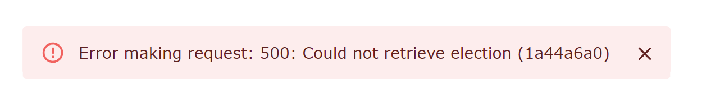

# Ahh a bug! What do I do?

Don't panic! This guide is here to help you through it

## Triage error

**Check Console Log**: Start by checking the front-end console log (ctrl+shift+i) in the browser

**Is it a backend error?**: If the console log says "the server responded with a status of ...", then you'll need to go to the backend. If you doesn't say that you can try searching the error in "common front-end errors"

**Request ID**: Make a note of the request id in the front-end prompt so that you can find it in the backend logs (in that example that would be 1a44a6a0 )

**Are you running back-end locally?**: If you're running the back-end locally you can find the error in the backend log and then go to the "common back-end errors" section. If you're not running the back-end locally you can access the logs in azure

## Accessing Azure logs

> NOTE: This assumes you've completed the Azure onboarding under Infrastructure

1. Open the "Container Apps" service
1. Open star-server > Monitoring > Log Stream
1. Scroll through the recent logs, and find the matching request id

> TODO: There's also Monitoring > Logs where you can query the request id. That would be handy but we haven't figured out how to do that yet

## Common front-end errors

Here are some common frontend errors and what to do about them

### Each child in list should have a unique "key" prop

This happens when you're generate a series of react components using an iterator

If you don't add a key field react will have a harder time tracking the components, and if that can be a performance issue

We plan to fix these errors eventually, but you can ignore them for now
 
## Common back-end errors

Nothing yet