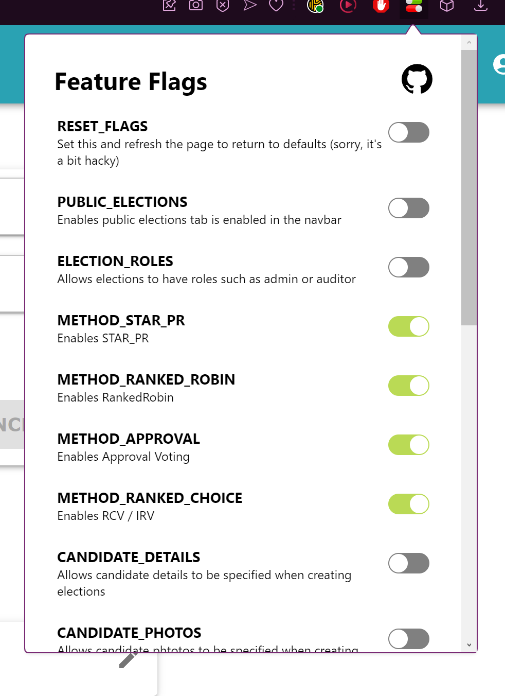

# How to enable beta features

We have a lot of features in progress that are mostly ready, but aren't quite polished enough to be enabled by default yet.

These could be a variety of things including voting methods or advanced election admin features. It also includes features that make it easier for testers to run regression testing.

Here's how you enable these features

1. Make sure you're using a browser that's compatible with the chrome web store (like Google Chrome or Opera)
2. [Install the feature flags plugin](https://chromewebstore.google.com/detail/feature-flags/hmflgmhoghcbmckbbgahfmklegllkggn?pli=1)
3. Once it's installed you can select the plugin at the top-right of the screen to choose between the features

By default the flags to whatever the current default is for the website. If you'd like to return to the default you can toggle the Reset flag

NOTE: At the time of writing all the flags are set to false by default, but this will change as we release more features